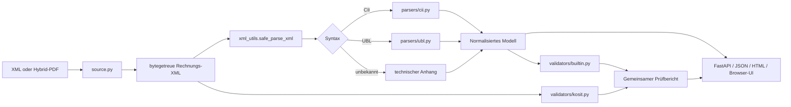

# Architektur

## Ziel

Die Anwendung trennt Eingabeextraktion, XML-Sicherheit, syntaktische Parser, normalisiertes Rechnungsmodell, Prüfungen und Darstellung. Dadurch können neue Syntaxfelder oder Regeln ergänzt werden, ohne die Originaldaten zu verlieren.

## Komponenten

### Eingabe und Extraktion

`app/source.py` erkennt XML und PDF anhand der Bytes, nicht nur anhand von Dateiendungen. Bei PDFs werden eingebettete Dateien über pypdf gelesen. Bekannte Rechnungsnamen wie `factur-x.xml` und `zugferd-invoice.xml` haben Vorrang. Die PDF selbst und jede eingebettete Datei erhalten Größen- und SHA-256-Metadaten.

Eine PDF ohne eingebettete XML löst einen Eingabefehler aus. Es gibt absichtlich keine OCR-Rückfallebene.

### Sichere XML-Verarbeitung

`app/xml_utils.py` weist DTD- und ENTITY-Deklarationen bereits vor dem Parsen ab. lxml wird mit deaktivierter Entitätsauflösung, deaktiviertem DTD-Laden und deaktiviertem Netzwerkzugriff verwendet. Das ursprüngliche Bytearray bleibt separat erhalten; Pretty-Printing dient nur der Anzeige.

### Syntaxparser

`app/parsers/cii.py` und `app/parsers/ubl.py` übersetzen syntaktspezifische Elemente in dieselbe Dictionary-Struktur. Gemeinsame Bezeichnungen und Hilfsfunktionen liegen in `app/parsers/common.py` und `app/code_lists.py`.

Die Parser sollen keine fachliche Gültigkeit behaupten. Fehlende oder unbekannte Elemente werden möglichst als `None` belassen. Alle nicht normalisierten Daten bleiben über den technischen Anhang zugänglich.

### Normalisiertes Modell

Wesentliche Top-Level-Bereiche:

- `document`, `profile`, `source`
- `seller`, `buyer`, `payee`, `invoicee`, `delivery_party`
- `lines`, `taxes`, `totals`, `payment`
- `references`, `delivery`, `notes`, `attachments`
- `technical`, `validation`, `processing`

Beträge und Mengen werden zunächst als XML-Text erhalten. Für Berechnungen konvertiert die interne Prüfung explizit zu `Decimal`.

### Interne Prüfung

`app/validators/builtin.py` erzeugt Befunde mit stabiler ID, Severity, Titel, Nachricht, Ort, Ist- und Sollwert. Sie prüft Pflichtfelder, Codes, Datumsfolgen, Geldberechnungen, Steuerkonsistenz, IBAN/BIC und ausgewählte semantische Widersprüche.

### KoSIT

`app/validators/kosit.py` validiert die Konfiguration, startet Java in einem temporären Verzeichnis, liest die von KoSIT serialisierte VARL-Berichtdatei und übernimmt Fehlermeldungen. Eine valide `<rep:assessment>`-Entscheidung ist maßgeblich. Startfehler ohne auswertbaren Bericht sind kein Rechnungsurteil.

### API und UI

`app/main.py` bietet Upload-, Analyse-, Bericht-, XML-Export- und Health-Endpunkte. `app/static/app.js` rendert das JSON-Modell in die interaktive Oberfläche. `app/templates/report.html` erzeugt einen eigenständigen, druckbaren HTML-Bericht.

## Erweiterungspunkte

### Neues Feld in CII oder UBL

1. Geschäftsbedeutung und Kardinalität dokumentieren.
2. Feld im jeweiligen Parser ergänzen.
3. Gemeinsame Darstellung bei Bedarf in beiden Parsern ergänzen.
4. UI und HTML-Bericht aktualisieren.
5. anonymisierte Tests für Syntax, Anzeige und technischen Anhang ergänzen.

### Neue interne Regel

1. stabile Regel-ID wählen;
2. Severity und fachliche Grenze festlegen;
3. Befund in `validate_builtin` erzeugen;
4. positiven und negativen Test hinzufügen;
5. Regel in `docs/VALIDATION.md` dokumentieren.

### Weitere Syntax

Eine neue Syntax benötigt einen eigenen Parser und eine Erkennung in `app/analyzer.py`. Das normalisierte Modell und die Darstellung sollten möglichst unverändert bleiben.
