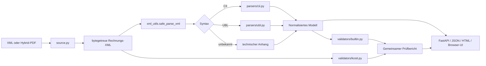

# Architektur

## Ziel

Die Anwendung trennt Eingabeextraktion, XML-Sicherheit, syntaktische Parser, normalisiertes Rechnungsmodell, Prüfungen und Darstellung. Dadurch können neue Syntaxfelder oder Regeln ergänzt werden, ohne die Originaldaten zu verlieren.

## Komponenten

### Eingabe und Extraktion

`app/source.py` erkennt XML und PDF anhand der Bytes, nicht nur anhand von Dateiendungen. Bei PDFs werden eingebettete Dateien über pypdf gelesen. Bekannte Rechnungsnamen wie `factur-x.xml` und `zugferd-invoice.xml` haben Vorrang. Die PDF selbst und jede eingebettete Datei erhalten Größen- und SHA-256-Metadaten.

Eine PDF ohne eingebettete XML löst einen Eingabefehler aus. Es gibt absichtlich keine OCR-Rückfallebene.

### Sichere XML-Verarbeitung

`app/xml_utils.py` weist DTD- und ENTITY-Deklarationen bereits vor dem Parsen ab. lxml wird mit deaktivierter Entitätsauflösung, deaktiviertem DTD-Laden und deaktiviertem Netzwerkzugriff verwendet. Die von `app/source.py` extrahierte Rechnungs-XML bleibt als unveränderte `bytes` getrennt vom geparsten Baum erhalten. Nur diese Bytes sind die Grundlage des bytegetreuen Exports über `/api/xml`; Pretty-Printing dient ausschließlich der Anzeige.

### Technische XML-Darstellungen

Die Anwendung stellt dieselbe Rechnungs-XML für unterschiedliche Zwecke in vier Formen bereit:

- `ExtractedSource.xml_bytes` enthält intern die unveränderten Bytes der direkt hochgeladenen oder aus einer PDF extrahierten XML. `/api/xml` gibt genau diese Bytes zurück.
- `technical.original_xml` ist eine anhand der XML-Deklaration dekodierte Textansicht der Quelldaten. Sie ist für JSON und HTML bestimmt, aber keine Bytegenauigkeitsgarantie.
- `technical.raw_xml` wird aus dem geparsten XML-Baum neu serialisiert und eingerückt. Diese Darstellung kann sich in Formatierung und XML-Deklaration von der Quelle unterscheiden.
- `technical.rows` ist eine navigierbare Tabelle aus nichtleerem direktem Elementtext und Attributen mit Pfad und Namespace-URI. Die Namespace-Deklarationen des Wurzelelements werden als zusätzliche Zeilen aufgenommen. Element- und Attributzeilen sind durch `MAX_TECHNICAL_ROWS` begrenzt; `technical.truncated` zeigt eine Kürzung an.

Die Tabelle ist keine verlustfreie XML-Repräsentation: Leere Elemente, Kommentare, Processing Instructions und lokal deklarierte Namespace-Bindungen erscheinen nicht zwingend als eigene Zeilen. Für die vollständige Quelle und den bytegetreuen Export bleiben die unveränderten XML-Bytes maßgeblich.

### Syntaxparser

`app/parsers/cii.py` und `app/parsers/ubl.py` übersetzen syntaktspezifische Elemente in dieselbe Dictionary-Struktur. Gemeinsame Bezeichnungen und Hilfsfunktionen liegen in `app/parsers/common.py` und `app/code_lists.py`.

Die Parser sollen keine fachliche Gültigkeit behaupten. Fehlende oder unbekannte Elemente werden möglichst als `None` belassen. Nicht normalisierte Daten bleiben über die XML-Textansichten und den bytegetreuen Export zugänglich; die technische Tabelle bietet dafür eine strukturierte, gegebenenfalls gekürzte Navigation.

### Normalisiertes Modell

Wesentliche Top-Level-Bereiche:

- `document`, `profile`, `source`
- `seller`, `buyer`, `payee`, `invoicee`, `ship_to`
- `lines`, `taxes`, `totals`, `payment`
- `references`, `delivery`, `header_allowances_charges`
- `technical`, `validation`, `processing`

Hinweise liegen unter `document.notes`. Metadaten zu PDF-Anhängen stehen unter `source.attachments`; rechnungsbezogene Zusatzdokumente werden unter `references.additional_documents` normalisiert.

Beträge und Mengen werden zunächst als XML-Text erhalten. Für Berechnungen konvertiert die interne Prüfung explizit zu `Decimal`.

### Interne Prüfung

`app/validators/builtin.py` erzeugt Befunde mit stabiler ID, Severity, Titel, Nachricht, Ort, Ist- und Sollwert. Sie prüft Pflichtfelder, Codes, Datumsfolgen, Geldberechnungen, Steuerkonsistenz, IBAN/BIC und ausgewählte semantische Widersprüche.

### KoSIT

`app/validators/kosit.py` validiert die Konfiguration, startet Java in einem temporären Verzeichnis, liest die von KoSIT serialisierte VARL-Berichtdatei und übernimmt Fehlermeldungen. Eine valide `<rep:assessment>`-Entscheidung ist maßgeblich. Startfehler ohne auswertbaren Bericht sind kein Rechnungsurteil.

### API und UI

`app/main.py` bietet Upload-, Analyse-, Bericht-, XML-Export- und Health-Endpunkte. `app/static/app.js` rendert das JSON-Modell in die interaktive Oberfläche. `app/templates/report.html` erzeugt einen eigenständigen, druckbaren HTML-Bericht.

## Erweiterungspunkte

### Neues Feld in CII oder UBL

1. Geschäftsbedeutung und Kardinalität dokumentieren.
2. Feld im jeweiligen Parser ergänzen.
3. Gemeinsame Darstellung bei Bedarf in beiden Parsern ergänzen.
4. UI und HTML-Bericht aktualisieren.
5. anonymisierte Tests für Syntax, Anzeige und technischen Anhang ergänzen.

### Neue interne Regel

1. stabile Regel-ID wählen;
2. Severity und fachliche Grenze festlegen;
3. Befund in `validate_builtin` erzeugen;
4. positiven und negativen Test hinzufügen;
5. Regel in `docs/VALIDATION.md` dokumentieren.

### Weitere Syntax

Eine neue Syntax benötigt einen eigenen Parser und eine Erkennung in `app/analyzer.py`. Das normalisierte Modell und die Darstellung sollten möglichst unverändert bleiben.
