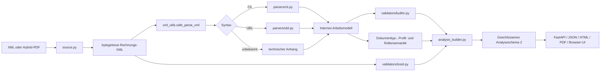
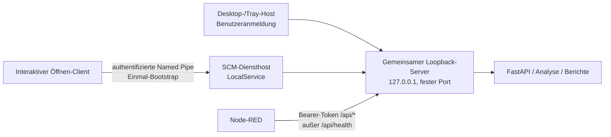

# Architektur

## Ziel

Die Anwendung trennt Eingabeextraktion, XML-Sicherheit, syntaktische Parser, internes Arbeitsmodell,
Dokument-/Profilsemantik, Prüfungen, öffentlichen Analysevertrag und Darstellung. Dadurch können neue
Syntaxfelder oder Regeln ergänzt werden, ohne die Originaldaten zu verlieren oder interne Parserdetails
versehentlich als API zu veröffentlichen.

```mermaid
flowchart LR
    A[XML oder Hybrid-PDF] --> B[source.py]
    B --> C[bytegetreue Rechnungs-XML]
    C --> D[xml_utils.safe_parse_xml]
    D --> E{Syntax}
    E -->|CII| F[parsers/cii.py]
    E -->|UBL| G[parsers/ubl.py]
    E -->|unbekannt| H[technischer Anhang]
    F --> I[Internes Arbeitsmodell]
    G --> I
    H --> I
    I --> J[validators/builtin.py]
    I --> S[Dokumenttyp-, Profil- und Rollensemantik]
    C --> K[validators/kosit.py]
    J --> L[analysis_builder.py]
    K --> L
    S --> L
    L --> V[Geschlossenes Analyseschema 2]
    V --> M[FastAPI / JSON / HTML / PDF / Browser-UI]
```

## Komponenten

### Eingabe und Extraktion

`app/source.py` erkennt XML und PDF anhand der Bytes, nicht nur anhand von Dateiendungen. Bei PDFs werden eingebettete Dateien über pypdf gelesen. Bekannte Rechnungsnamen wie `factur-x.xml` und `zugferd-invoice.xml` haben Vorrang. Die PDF selbst und jede eingebettete Datei erhalten Größen- und SHA-256-Metadaten.

Eine PDF ohne eingebettete XML löst einen Eingabefehler aus. Es gibt absichtlich keine OCR-Rückfallebene.

### Sichere XML-Verarbeitung

`app/xml_utils.py` weist DTD- und ENTITY-Deklarationen bereits vor dem Parsen ab. lxml wird mit deaktivierter Entitätsauflösung, deaktiviertem DTD-Laden und deaktiviertem Netzwerkzugriff verwendet. Die von `app/source.py` extrahierte Rechnungs-XML bleibt als unveränderte `bytes` getrennt vom geparsten Baum erhalten. Nur diese Bytes sind die Grundlage des bytegetreuen Exports über `/api/xml`; Pretty-Printing dient ausschließlich der Anzeige.

### Technische XML-Darstellungen

Die Anwendung stellt dieselbe Rechnungs-XML für unterschiedliche Zwecke in vier Formen bereit:

- `ExtractedSource.xml_bytes` enthält intern die unveränderten Bytes der direkt hochgeladenen oder aus einer PDF extrahierten XML. `/api/xml` gibt genau diese Bytes zurück.
- `technical.source_xml` ist eine anhand der XML-Deklaration dekodierte Textansicht der Quelldaten. Sie ist für
  JSON und HTML bestimmt, aber keine Bytegenauigkeitsgarantie.
- `technical.pretty_xml` wird aus dem geparsten XML-Baum neu serialisiert und eingerückt. Diese Darstellung kann
  sich in Formatierung und XML-Deklaration von der Quelle unterscheiden.
- `technical.fields` ist eine navigierbare Tabelle aus nichtleerem direktem Elementtext und Attributen mit Pfad
  und Namespace-URI. Die Namespace-Deklarationen des Wurzelelements werden als zusätzliche Felder aufgenommen.
  Element- und Attributfelder sind durch `MAX_TECHNICAL_ROWS` begrenzt; `technical.truncated` zeigt eine Kürzung
  an und `assessment.processing.limitations` benennt den betroffenen JSON-Pointer.

Die Tabelle ist keine verlustfreie XML-Repräsentation: Leere Elemente, Kommentare, Processing Instructions und lokal deklarierte Namespace-Bindungen erscheinen nicht zwingend als eigene Zeilen. Für die vollständige Quelle und den bytegetreuen Export bleiben die unveränderten XML-Bytes maßgeblich.

Der per E-Mail geeignete PDF-Bericht begrenzt bei `scope=complete` seinen technischen Tabellen- und
Rohtextanhang zusätzlich und weist diese Begrenzung sichtbar aus. Diese Darstellungsgrenze verändert weder das
Analysemodell noch den bytegetreuen Export des vollständigen Original-XML. Im Standardumfang `readable` wird
der technische Anhang nicht ausgegeben.

### Syntaxparser

`app/parsers/cii.py` und `app/parsers/ubl.py` übersetzen syntaktspezifische Elemente zunächst in dieselbe interne
Dictionary-Struktur. Gemeinsame Bezeichnungen und Hilfsfunktionen liegen in `app/parsers/common.py` und
`app/code_lists.py`. Dieses Arbeitsmodell ist kein öffentlicher API-Vertrag.

Die Parser sollen keine fachliche Gültigkeit behaupten. Fehlende oder unbekannte Elemente werden möglichst als `None` belassen. Nicht normalisierte Daten bleiben über die XML-Textansichten und den bytegetreuen Export zugänglich; die technische Tabelle bietet dafür eine strukturierte, gegebenenfalls gekürzte Navigation.

Die Syntaxerkennung in `app/analyzer.py` verlangt die unterstützte Kombination aus Wurzelelement und exakt
passendem Namespace. Ein wohlgeformtes XML mit anderem Root oder Namespace wird als `UNKNOWN` ausgewiesen:
Interne Prüfungen laufen dann nicht, und `assessment.processing` enthält `SYNTAX-001` mit Status `incomplete`.

### Öffentliches Analyseschema 2

`app/analysis_builder.py` ist die einzige Übersetzungsgrenze vom internen Arbeitsmodell zu den geschlossenen
Pydantic-Modellen in `app/api_models.py`, `app/assessment.py` und `app/findings.py`. Die Top-Level-Bereiche sind:

- `schema_version`, `document`, `profile`, `capabilities`;
- `parties`, `roles`, `periods`, `delivery`, `references`;
- `lines`, `allowances_charges`, `tax`, `totals`, `payment`;
- `assessment`, `source`, `technical`, `runtime`.

Zusätzliche Modellfelder werden abgewiesen (`extra="forbid"`). Beträge, Mengen, Codes und Kennungen sind
strukturierte Objekte. Decimal-Werte werden im JSON als Zeichenfolgen serialisiert und daher nicht über binäre
Gleitkommazahlen verfälscht. Die XML-Decimal-Erkennung akzeptiert nur endliche Werte aus dem XML-Schema-
Dezimalraum; `NaN`, `Infinity`, Exponenten, Dezimalkomma und freie Texte werden nicht stillschweigend
uminterpretiert.

Hinweise liegen unter `document.notes[].text`. Upload und ausgewählte Rechnungs-XML stehen getrennt unter
`source.upload` und `source.invoice_xml`. Metadaten zu PDF-Anhängen stehen unter `source.attachments`;
rechnungsbezogene Zusatzdokumente werden unter `references.supporting_documents` normalisiert. Alle nicht
normalisierten XML-Daten bleiben über `technical.fields`, die XML-Textansichten und `/api/xml` zugänglich.

Ein einzelnes tatsächliches Lieferdatum und der Lieferort liegen unter `delivery`; ein echter
Liefer-/Leistungszeitraum liegt unter `periods.delivery`. Eine Lieferortkennung oder -anschrift wird nicht als
Lieferempfänger erfunden. Direkte Parteienkennungen und rechtliche Registerkennungen werden parserseitig
getrennt und im öffentlichen Modell über `PartyIdentifier.kind` kenntlich gemacht.

Schema 2 ersetzt den bisherigen Vertrag sofort am bestehenden Endpunkt. Es gibt keinen Legacy-Endpunkt oder
Adapter. Das konkrete Feldmapping ist in [`API_MIGRATION_V2.md`](API_MIGRATION_V2.md) dokumentiert.

### Dokumenttyp, Profil und Rollen

`app/document_types.py` enthält eine unveränderliche Registry der 62 von den gebündelten
CEN-EN-16931-Validierungsartefakten 1.3.15 verwendeten UNTDID-1001-Codes. Die Auflösung unterscheidet
`known`, `unknown` und `missing`; ein unbekannter Rohcode bleibt erhalten. Für UBL wird zusätzlich geprüft, ob
der Code mit `Invoice` beziehungsweise `CreditNote` kompatibel ist. Die Version und das Ergebnis werden unter
`document.type` veröffentlicht.

`app/profiles.py` erkennt XRechnung, EN 16931, Peppol Billing, Peppol Self-Billing, Factur-X und ZUGFeRD und
ordnet interne sowie offizielle Fähigkeiten zu. Unbekannte oder fehlende Profile bleiben als solche erhalten;
sie erhalten keine erfundene Vollunterstützung.

`app/document_semantics.py` trennt die Rollen des Dokumentaustauschs von der wirtschaftlichen
Gläubiger-/Schuldnerbeziehung. Self-Billing kann den Käufer zum Dokumentaussteller machen, ohne ihn dadurch zum
Gläubiger zu machen. Aus Typgrundpolarität und Vorzeichen entsteht nur eine erwartete Abwicklungsrichtung.
`roles.expected_payer`, `roles.expected_recipient` und `roles.expected_payment_direction` sind daher eine
nachvollziehbare Erwartung, kein Beleg einer tatsächlichen, fälligen oder bereits ausgeführten Zahlung. Bei einem
Konflikt zwischen Profil- und Typaussage werden Rollen nicht geraten.

### Interne Prüfung

`app/validators/builtin.py` erzeugt Befunde mit stabiler ID, Severity, Titel, Nachricht, Regelquelle und Ist-/
Sollwert. `app/analysis_builder.py` überführt sie in strukturierte Schema-2-Befunde:

- `semantic_references` für fachliche BG-/BT-Bezüge;
- `occurrence` mit Scope, Index und optionalem JSON-Pointer;
- `xml_location` ausschließlich für einen echten XML-Pfad beziehungsweise Zeile/Spalte;
- `actual` und `expected` als typisierte Evidenz.

Ein Code wie `BG-16` ist deshalb kein „Ort“, sondern eine semantische Referenz. Die interne Prüfung kontrolliert
Pflichtfelder, Codes, Datumsfolgen, Geldberechnungen, Steuerkonsistenz, IBAN/BIC und ausgewählte semantische
Widersprüche.

### Bewertungsachsen

`assessment` enthält drei voneinander unabhängige Zustandsautomaten:

- `official`: offizielle KoSIT-Konformität;
- `internal`: interne Vorprüfungen und Plausibilitätskontrollen;
- `processing`: technischer Abschluss, Einschränkungen und Betriebsbefunde.

Befunde werden nach Herkunft auf genau eine Achse verteilt. Ein technischer KoSIT-Start- oder Timeoutfehler darf
weder zur offiziellen Ablehnung noch zum internen Rechnungsfehler werden. Umgekehrt ist eine offizielle
Ablehnung kein fehlgeschlagener Verarbeitungslauf. Ein gemeinsamer Status wird bewusst nicht mehr gebildet.

### KoSIT

`app/validators/kosit.py` validiert die Konfiguration, startet Java in einem temporären Verzeichnis, liest die von KoSIT serialisierte VARL-Berichtdatei und übernimmt Fehlermeldungen. Eine valide `<rep:assessment>`-Entscheidung ist maßgeblich. Startfehler ohne auswertbaren Bericht sind kein Rechnungsurteil.

Die für Installation und Windows-Paket zulässigen Artefakte stehen mit SHA-256 in
`packaging/kosit/components.lock.json`. Der öffentliche Health-Endpunkt übernimmt nur die Versionsangaben aus
`app/component_versions.py`, niemals lokale Installationspfade.

### API und UI

`app/main.py` bietet Upload-, Analyse-, HTML-/PDF-Bericht-, XML-Export- und Health-Endpunkte.
`POST /api/analyze` validiert seine Antwort gegen `AnalysisResponse`. HTML und PDF veröffentlichen sechs
Schema-2-Header für Version, Syntax, die drei Achsen und den Darstellungsumfang; die beiden früheren
Statusheader werden nicht mehr ausgegeben. Beide Berichts-Endpunkte verwenden standardmäßig
`scope=readable`; `scope=complete` ergänzt die technischen Anhänge.

`app/static/app.js` rendert das JSON-Modell in die interaktive Oberfläche. Der gemeinsame Präsentationsvertrag
und das daraus gebildete Berichtsmodell halten deutsche Statusbezeichnungen, Kopffakten, Zahlungsfluss und
Abschnittsreihenfolge für die Ausgabewege synchron. `app/templates/report.html` erzeugt einen eigenständigen,
druckbaren HTML-Bericht; `app/pdf_report.py` erzeugt aus demselben Berichtsmodell den speicherbasierten,
paginierten PDF-Bericht mit
eingebetteten Noto-Unicode-Schriften. Vor dem Layout begrenzt der Renderer die Anzahl von Positionen,
Prüfmeldungen und Hinweisen sowie Einzelwerte, Gesamttext und Zeilenumbrüche deterministisch. Nicht von Noto Sans
oder Noto Sans SC abgedeckte Zeichen erscheinen als sichtbarer Unicode-Codepunkt. Bei mehr als 200 benötigten
Seiten wird ein kompakter, gültiger Ersatzbericht erzeugt. PDF-Renderings laufen außerhalb des ASGI-Event-Loops
und pro Prozess höchstens zweimal parallel. Auch die vorgelagerte Rechnungsanalyse einschließlich einer
angeforderten KoSIT-Prüfung läuft außerhalb des Event-Loops und wird pro Prozess auf zwei gleichzeitige Analysen
begrenzt, sodass Healthchecks und weitere lokale Requests während längerer Prüfungen beantwortbar bleiben. Sind
beide Plätze belegt, antwortet die API sofort mit `503` und einem begrenzten `Retry-After`, statt weitere Arbeit
hinter möglicherweise bereits abgebrochenen Clientanfragen aufzustauen.

Kartennummern werden an der öffentlichen Vertragsgrenze maskiert; technische Feld- und XML-Textansichten werden
um erkannte rohe Kartenwerte bereinigt. Browser-, HTML- und PDF-Renderer behandeln die Maskierung zusätzlich
defensiv. Der bytegetreue `/api/xml`-Export bleibt absichtlich unverändert und ist daher kein anonymisierter
Export.

### Windows-Betriebsarten

Die Windows-Paketierung stellt denselben Anwendungs- und Prüfcode über zwei alternative Hosts bereit:

```mermaid
flowchart LR
    D["Desktop-/Tray-Host<br/>Benutzeranmeldung"] --> R["Gemeinsamer Loopback-Server<br/>127.0.0.1, fester Port"]
    S["SCM-Diensthost<br/>LocalService"] --> R
    R --> A["FastAPI / Analyse / Berichte"]
    C["Interaktiver Öffnen-Client"] -->|"authentifizierte Named Pipe<br/>Einmal-Bootstrap"| S
    N["Node-RED"] -->|"Bearer-Token /api/*<br/>außer /api/health"| R
```

`app/server_runtime.py` kapselt Socketreservierung, Healthcheck und Uvicorn-Lebenszyklus ohne UI-Abhängigkeit.
`app/windows_launcher.py` ergänzt für den Desktopmodus Tray, Benutzer-Mutex, Browserstart und HKCU-kompatiblen
Hintergrundbetrieb. `app/windows_service.py` bildet den SCM-Lebenszyklus ab, aktiviert die Maschinenkonfiguration
vor dem Import von `app.main` und öffnet in Session 0 keine interaktive Oberfläche.

Beide Hosts konkurrieren um denselben geschützten maschinenweiten Backend-Mutex und denselben festen
Loopback-Port; es kann daher genau eine Betriebsart aktiv sein. Der Dienst läuft als `LocalService` mit eigenem
Service-SID. Maschinenkonfiguration, API-Token und technische Logs liegen mit geschützten DACLs unter
`%ProgramData%`, während unveränderliche Binärdateien unter `%ProgramFiles%` installiert werden.

Der Öffnen-Client erhält über lokale Named-Pipe-IPC ausschließlich einen kurzlebigen, einmaligen Browserbootstrap.
Das persistente API-Bearer-Token ist davon getrennt und schützt die fachlichen `/api/*`-Endpunkte;
`/api/health` bleibt als lokaler Healthcheck tokenfrei. Dadurch bleiben Browserbedienung und Node-RED-API in
beiden Hosts verfügbar, ohne das dauerhafte Token in Browser-URLs oder Browser-Speicher zu geben.
Die Architekturentscheidung ist in [`adr/0001-windows-service-mode.md`](adr/0001-windows-service-mode.md)
dokumentiert.

## Erweiterungspunkte

### Neues Feld in CII oder UBL

1. Geschäftsbedeutung und Kardinalität dokumentieren.
2. Feld im jeweiligen Parser ergänzen.
3. Feld explizit in `analysis_builder.py` und gegebenenfalls den geschlossenen Pydantic-Modellen abbilden.
4. Gemeinsame Darstellung bei Bedarf in beiden Parsern ergänzen.
5. UI, HTML- und PDF-Bericht aktualisieren.
6. anonymisierte Tests für Parser, Schema-2-Vertrag, Anzeige und technischen Anhang ergänzen.

### Neue interne Regel

1. stabile Regel-ID wählen;
2. Severity und fachliche Grenze festlegen;
3. fachliche `semantic_references` und einen echten Vorkommensbereich festlegen;
4. Befund in `validate_builtin` erzeugen;
5. positiven und negativen Test einschließlich Achsenzuordnung hinzufügen;
6. Regel in `docs/VALIDATION.md` dokumentieren.

### Weitere Syntax

Eine neue Syntax benötigt einen eigenen Parser, eine exakte Root-/Namespace-Erkennung in `app/analyzer.py` und
eine explizite Capability-Abbildung. Das interne Arbeitsmodell darf erweitert werden; der öffentliche
Schema-2-Vertrag ändert sich nur bewusst und versioniert.
